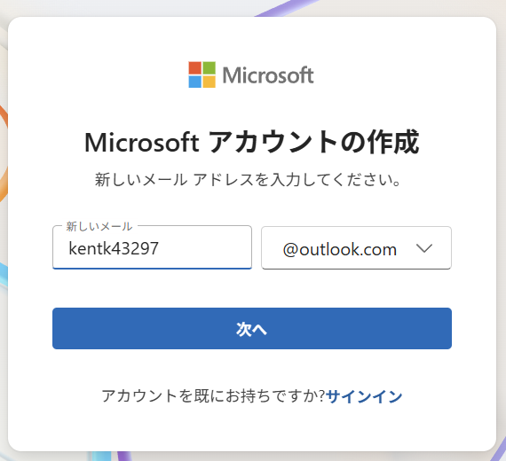
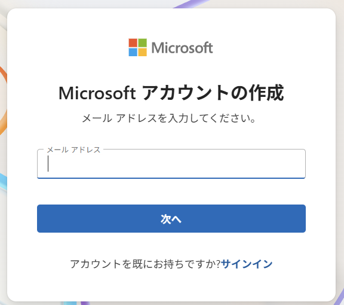
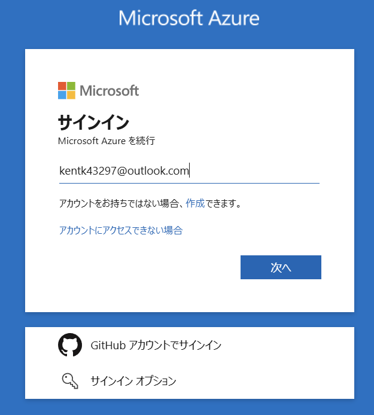
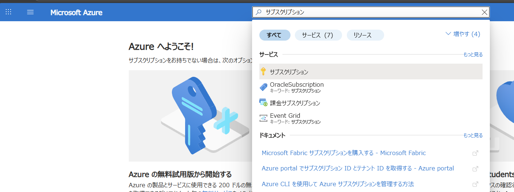

# Entra ID Free の作り方

このドキュメントでは、Entra ID Free の作成方法について説明します。Entra ID Free は、Microsoft Entra の無料プランであり、基本的なアイデンティティ管理機能を提供します。

## 大まかな流れ
1. **Microsoft アカウントの作成**: Entra ID Free を利用するためには、Microsoft アカウントが必要です。まずは、Microsoft アカウントを作成するためのメールアドレスを用意します。
2. **Microsoft Azure サブスクリプションの作成**: Microsoft Azure の無料サブスクリプションを作成します。これにより、Entra ID Free を利用するための環境が整います。

## Microsoft アカウントの作成

これまでに Microsoft Azure を作成したことのない Microsoft アカウントが必要です。もし、すでに Microsoft アカウントをお持ちであれば、この手順をスキップできます。

お持ちでない場合はフリーメールなどを使って Microsoft アカウントを作成します。

もしマイクロソフトのフリーメールサービス Outlook.com で新規のメールアドレスを取得する場合には以下から作成できます。この場合は Microsoft アカウントも同時に作成されます。

[https://http://outlook.com/](https://http://outlook.com/)

フリーメールアドレスを取得したら、以下のリンクから Microsoft アカウントを作成します。

[https://signup.live.com/signup.aspx](https://signup.live.com/signup.aspx)

## Microsoft Azure サブスクリプションの作成

Microsoft アカウントを作成したら、次に Microsoft Azure の無料サブスクリプションを作成します。以下のリンクから Azure ポータルにアクセスし、サインインします。

[https://portal.azure.com/](https://portal.azure.com/)

検索窓に「サブスクリプション」と入力し、Enter キーを押します。

